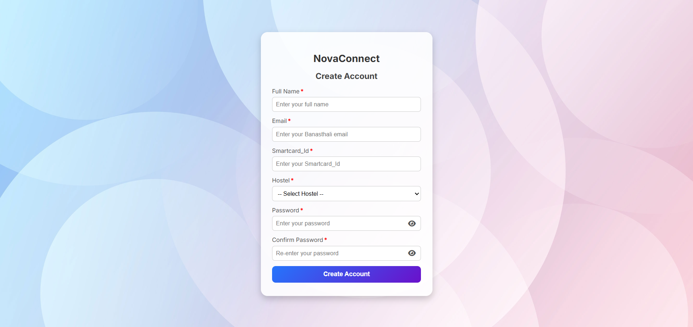
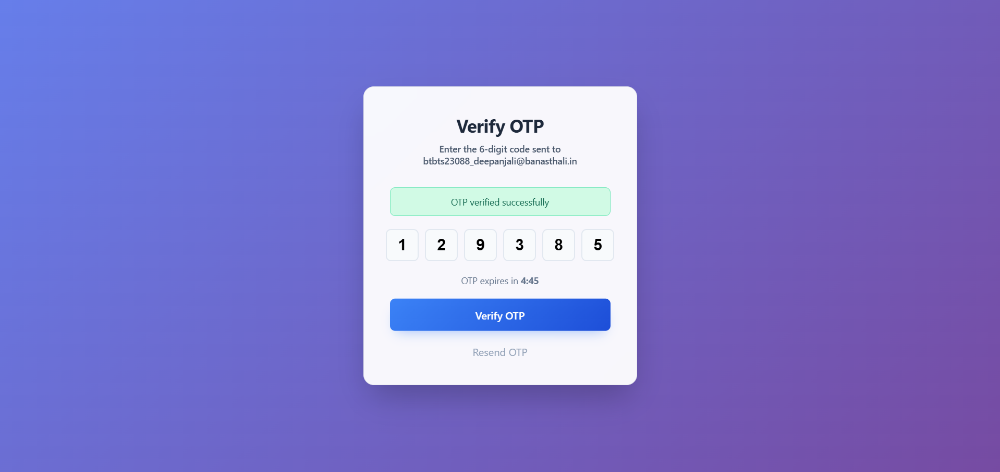
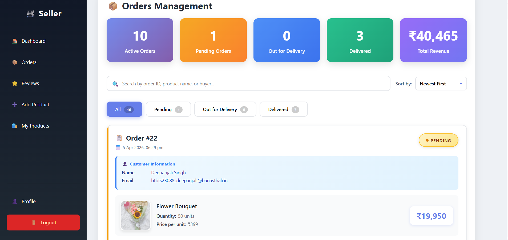
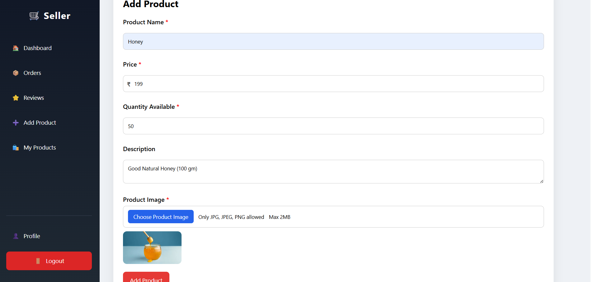
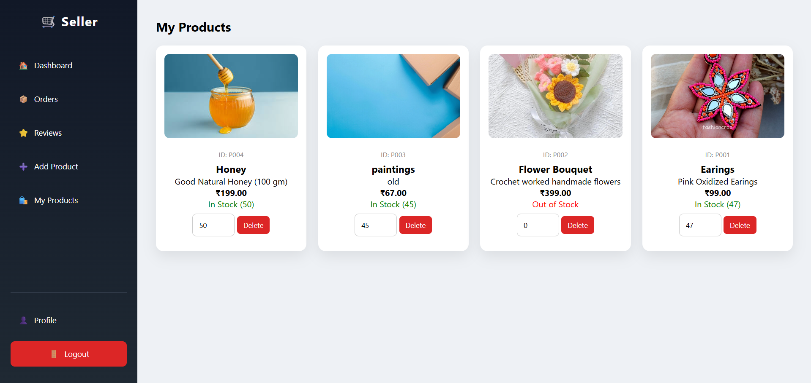
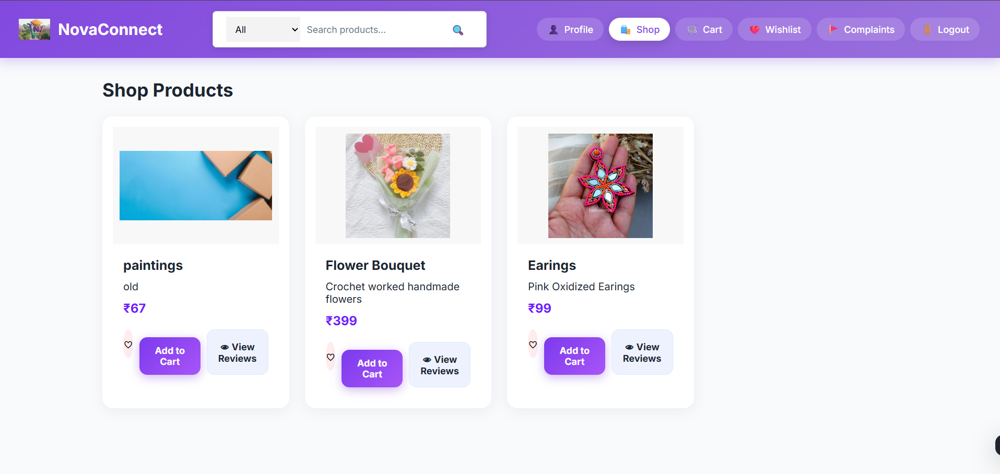
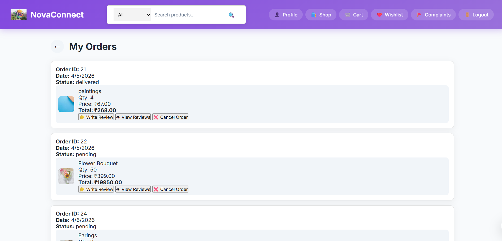
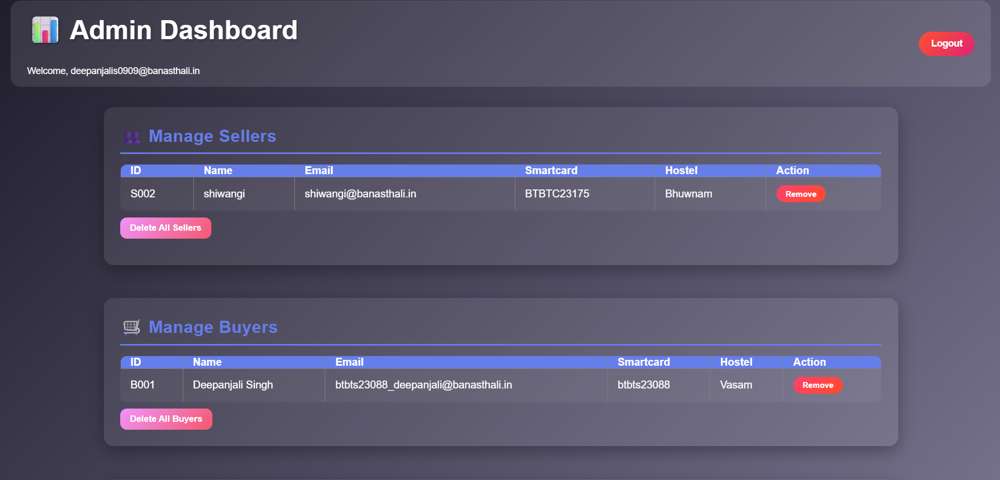
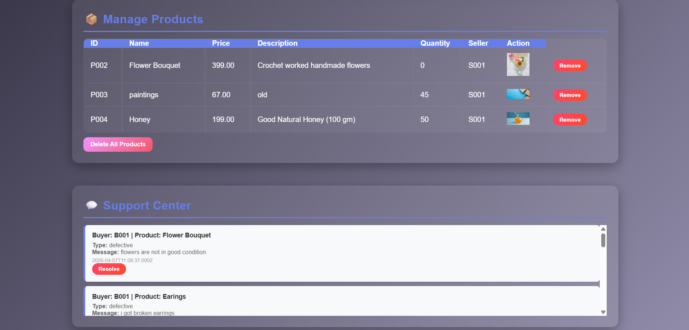

# 🚀 NovaConnect

**NovaConnect** is a community-driven marketplace platform designed to empower student entrepreneurs by providing a dedicated space to showcase, promote, and sell their products within a trusted community ecosystem.

---

## 📖 Project Overview

Many students create innovative products such as handmade crafts, jewelry, artwork, candles, customized gifts, and digital services but struggle to find customers.

NovaConnect solves this problem by offering a centralized marketplace where:

* Student entrepreneurs can showcase and manage their products.
* Buyers can discover unique student-made products.
* Administrators can maintain platform quality and user trust.

---

## ✨ Key Features

### 🛒 Buyer Features

* Browse products from student sellers
* Search and filter products by category
* View detailed product information
* Submit ratings and reviews
* Raise complaints and support requests

### 🏪 Seller Features

* Seller registration and profile management
* Add, edit, and delete products
* Manage product listings
* Track customer interactions
* View customer reviews and feedback

### ⚙️ Admin Features

* Manage buyers and sellers
* Review and resolve complaints
* Moderate product listings
* Monitor platform activities
* Maintain marketplace integrity

---

## 🛠️ Technology Stack

| Category          | Technologies            |
| ----------------- | ----------------------- |
| Frontend          | HTML5, CSS3, JavaScript |
| Backend           | Node.js, Express.js     |
| Database          | MySQL                   |
| Authentication    | Express Session         |
| Development Tools | Git, GitHub, VS Code    |

---

## 📸 Screenshots

### Home Page


### Sign Up Page


### Forgot Password


### Seller Dashboard


### Add Products


### Product Listing Page


### Buyer Dashboard


### Orders Management


### Admin Dashboard




---

## ⚙️ Installation & Setup

### 1. Clone the Repository

```bash
https://github.com/deepanjalis0909/-NovaConnect.git
```

### 2. Navigate to Project Directory

```bash
cd Novaconnect
```

### 3. Install Dependencies

```bash
npm install
```

### 4. Configure Database

Create a MySQL database:

```sql
CREATE DATABASE seller_dashboard;
```

Import the provided SQL file and update the database credentials in the configuration file.

### 5. Start the Server

```bash
node server.js
```

### 6. Access the Application

Open your browser and visit:

```text
http://localhost:3000/novaconnect_2ndpage.html
```

---

## 📂 Project Structure

```text
NOVACONNECT/
│
├── seller_backend/
│   ├── public/
│   │   ├── images/
│   │   ├── admin_dashboard.html
│   │   ├── admin_signup.html
│   │   ├── admin.html
│   │   ├── buyer_dashboard.html
│   │   ├── contact.html
│   │   ├── dashboard.html
│   │   ├── forgot_password.html
│   │   ├── home.html
│   │   ├── index.html
│   │   ├── landing.css
│   │   ├── login.html
│   │   ├── services.html
│   │
│   ├── server.js
│   ├── db.js
│   ├── package.json
│   └── package-lock.json
│
└── README.md

```

---

## 🎯 Future Enhancements

* Real-time buyer-seller chat
* Online payment gateway integration
* Mobile application support

---

## 💡 Learning Outcomes

This project helped us gain practical experience in:

* Full Stack Web Development
* Database Design and Management
* Authentication and Session Handling
* RESTful Backend Development
* User Experience Design
* Collaborative Development using Git & GitHub

---

## 👥 Team Members

* Deepanjali
* Shalvi Rastogi 
* Sakshi Bisht
* Ritika Singhal

---

This project was developed for educational and academic purposes.

---
